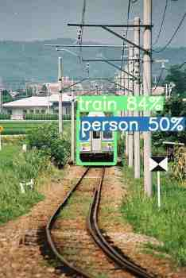
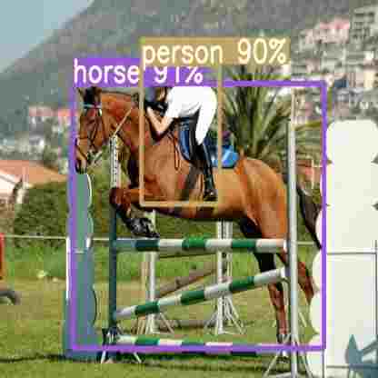
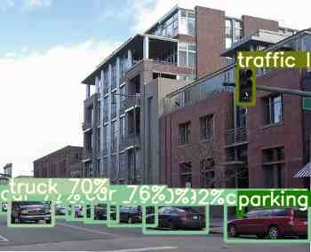

# YOLOv4-PyTorch

<p align="center"></p>
<p align="center"></p>
<p align="center"></p>

### Overview
The inspiration for this project comes from [ultralytics/yolov3](https://github.com/ultralytics/yolov3) && [AlexeyAB/darknet](https://github.com/AlexeyAB/darknet) Thanks.

This project is a [YOLOv4](https://arxiv.org/abs/2004.10934) object detection system. Development framework by [PyTorch](https://pytorch.org/).

The goal of this implementation is to be simple, highly extensible, and easy to integrate into your own projects. 
This implementation is a work in progress -- new features are currently being implemented.  

### Table of contents
1. [About YOLOv4](#about-yolov4)
2. [Installation](#installation)
    * [Clone and install requirements](#clone-and-install-requirements)
    * [Download pre-trained weights](#download-pre-trained-weights)
    * [Download PascalVoc2007](#download-pascalvoc2007)
    * [Download COCO2014](#download-coco2014)
    * [Download COCO2017](#download-coco2017)
3. [Usage](#usage)
    * [Train](#train)
    * [Test](#test)
    * [Inference](#inference)
4. [Train on Custom Dataset](#train-on-custom-dataset)
5. [Credit](#credit) 

### About YOLOv4
There are a huge number of features which are said to improve Convolutional Neural Network (CNN) accuracy. 
Practical testing of combinations of such features on large datasets, and theoretical justification of the result, is required. 
Some features operate on certain models exclusively and for certain problems exclusively, or only for small-scale datasets; 
while some features, such as batch-normalization and residual-connections, are applicable to the majority of models, tasks, and datasets. 
We assume that such universal features include Weighted-Residual-Connections (WRC), Cross-Stage-Partial-connections (CSP), Cross mini-Batch Normalization (CmBN), Self-adversarial-training (SAT) and Mish-activation. 
We use new features: WRC, CSP, CmBN, SAT, Mish activation, Mosaic data augmentation, CmBN, DropBlock regularization, and CIoU loss, and combine some of them to achieve state-of-the-art results: 43.5% AP (65.7% AP50) for the MS COCO dataset at a realtime speed of ~65 FPS on Tesla V100. 
Source code is at [this https URL](https://github.com/AlexeyAB/darknet).

### Installation

#### Clone and install requirements
```bash
git clone https://github.com/Lornatang/YOLOv4-PyTorch.git
cd YOLOv4-PyTorch/
pip install -r requirements.txt
```

#### Download pre-trained weights
```bash
cd weights/
bash download_weights.sh
```

#### Download PascalVoc2007
```bash
cd data/
bash get_voc_dataset.sh
```

#### Download COCO2014
```bash
cd data/
bash get_coco2014_dataset.sh
```

#### Download COCO2017
```bash
cd data/
bash get_coco2017_dataset.sh
```

### Usage

#### Train
- Example (COCO2017)

To train on COCO2014/COCO2017 run: 
```bash
python train.py --config-file configs/COCO-Detection/yolov5-small.yaml --data data/coco2017.yaml --weights ""
```

- Example (VOC2007+2012)

To train on VOC07+12 run:
```bash
python train.py --config-file configs/PascalVOC-Detection/yolov5-small.yaml --data data/voc2007.yaml --weights ""
```

- Other training methods

**Normal Training:** `python train.py --config-file configs/COCO-Detection/yolov5-small.yaml  --data data/coco2014.yaml --weights ""` 
to begin training after downloading COCO data with `data/get_coco2014_dataset.sh`. 
Each epoch trains on 117,263 images from the train and validate COCO sets, and tests on 5000 images from the COCO validate set.

**Resume Training:** `python train.py --config-file configs/COCO-Detection/yolov5-small.yaml  --data data/coco2014.yaml --resume` 
to resume training from `weights/checkpoint.pth`.

#### Test
All numbers were obtained on local machine servers with 2 NVIDIA GeForce RTX 2080 SUPER GPUs & NVLink. 
The software in use were PyTorch 1.5.1, CUDA 10.2, cuDNN 7.6.5.

- Example (COCO2017)

To train on COCO2014/COCO2017 run: 
```bash
python test.py --config-file configs/COCO-Detection/yolov5-small.yaml --data data/coco2017.yaml --weights weights/COCO-Detection/yolov5-small.pth
```

- Example (VOC2007+2012)

To train on VOC07+12 run:
```bash
python test.py --config-file configs/PascalVOC-Detection/yolov5-small.yaml --data data/voc2007.yaml --weights weights/PascalVOC-Detection/yolov5-small.pth
```

**Common Settings for VOC Models**

* All VOC models were trained on `voc2007_trainval` + `voc2012_trainval` and evaluated on `voc2007_test`.
* The default settings are __not directly comparable__ with YOLOv4's standard settings. 
The default settings are __not directly comparable__ with Detectron's standard settings.
  For example, our default training data augmentation uses scale jittering in addition to horizontal flipping.
* For YOLOv3/YOLOv4, we provide baselines based on __2 different backbone combinations__:
  * __Darknet-53__: Use a ResNet+VGG backbone with standard conv and FC heads for mask and box prediction,
    respectively. 
  * __CSPDarknet-53__: Use a ResNet+CSPNet backbone with standard conv and FC heads for mask and box prediction,
    respectively. It obtains the best
    speed/accuracy tradeoff, but the other two are still useful for research.
    
##### Pascal VOC Object Detection Baselines

<table><tbody>
<!-- START TABLE -->
<!-- TABLE HEADER -->
<th valign="bottom">Model</th>
<th valign="bottom">train<br/>time<br/>(s/iter)</th>
<th valign="bottom">inference<br/>time<br/>(ms/im)</th>
<th valign="bottom">train<br/>mem<br/>(GB)</th>
<th valign="bottom">AP<sup>test</sup></th>
<th valign="bottom">AP<sub>50</sub></th>
<th valign="bottom">fps</th>
<th valign="bottom">params</th>
<th valign="bottom">FLOPs</th>
<th valign="bottom">download</th>
<!-- TABLE BODY -->
<!-- ROW: MobileNet-v1 -->
 <tr><td align="left"><a href="configs/PascalVOC-Detection/mobilenet-v1.yaml">MobileNet-v1</a></td>
<td align="center">9.6</td>
<td align="center">2.5</td>
<td align="center">4.0</td>
<td align="center">31.2</td>
<td align="center">61.3</td>
<td align="center">400</td>
<td align="center">4.95M</td>
<td align="center">11.3B</td>
<td align="center"><a href="https://github.com/Lornatang/YOLOv4-PyTorch/releases/download/v0.2/mobilenetv1-2a658240.pth">model</a></td>
</tr>
<!-- ROW: VGG16 -->
 <tr><td align="left"><a href="configs/PascalVOC-Detection/vgg16.yaml">VGG16</a></td>
<td align="center">-</td>
<td align="center">-</td>
<td align="center">-</td>
<td align="center">-</td>
<td align="center">-</td>
<td align="center">-</td>
<td align="center">-</td>
<td align="center">-</td>
<td align="center">-</td>
</tr>
<!-- ROW: YOLOv3-Tiny -->
 <tr><td align="left"><a href="configs/PascalVOC-Detection/yolov3-tiny.yaml">YOLOv3-Tiny</a></td>
<td align="center">10.5</td>
<td align="center">1.5</td>
<td align="center">3.7</td>
<td align="center">24.3</td>
<td align="center">53.1</td>
<td align="center">667</td>
<td align="center">7.96M</td>
<td align="center">10.5B</td>
<td align="center"><a href="https://github.com/Lornatang/YOLOv4-PyTorch/releases/download/v0.2/yolov3-tiny-9b89a609.pth">model</a></td>
</tr>
<!-- ROW: YOLOv3 -->
 <tr><td align="left"><a href="configs/PascalVOC-Detection/yolov3.yaml">YOLOv3</a></td>
<td align="center">2.4</td>
<td align="center">6.7</td>
<td align="center">6.4</td>
<td align="center">57.9</td>
<td align="center">82.6</td>
<td align="center">149</td>
<td align="center">61.79M</td>
<td align="center">155.6B</td>
<td align="center"><a href="https://github.com/Lornatang/YOLOv4-PyTorch/releases/download/v0.2/yolov3-df67e38d.pth">model</a></td>
</tr>
<!-- ROW: YOLOv3-SPP -->
 <tr><td align="left"><a href="configs/PascalVOC-Detection/yolov3-spp.yaml">YOLOv3-SPP</a></td>
<td align="center">2.4</td>
<td align="center">6.7</td>
<td align="center">6.3</td>
<td align="center">59.7</td>
<td align="center">83.3</td>
<td align="center">149</td>
<td align="center">62.84M</td>
<td align="center">156.5B</td>
<td align="center"><a href="https://github.com/Lornatang/YOLOv4-PyTorch/releases/download/v0.2/yolov3-spp-e90fa0a8.pth">model</a></td>
</tr>
<!-- ROW: YOLOv4-Tiny -->
 <tr><td align="left"><a href="configs/PascalVOC-Detection/yolov4-tiny.yaml">YOLOv4-Tiny</a></td>
<td align="center">12.3</td>
<td align="center">1.5</td>
<td align="center">2.7</td>
<td align="center">20.0</td>
<td align="center">46.0</td>
<td align="center">667</td>
<td align="center">3.10M</td>
<td align="center">6.5B</td>
<td align="center"><a href="https://github.com/Lornatang/YOLOv4-PyTorch/releases/download/v0.2/yolov4-tiny-d7f4c31e.pth">model</a></td>
</tr>
<!-- ROW: YOLOv4 -->
 <tr><td align="left"><a href="configs/PascalVOC-Detection/yolov4.yaml">YOLOv4</a></td>
<td align="center">2.1</td>
<td align="center">7.5</td>
<td align="center">6.7</td>
<td align="center">61.4</td>
<td align="center">83.7</td>
<td align="center">133</td>
<td align="center">60.52M</td>
<td align="center">131.6B</td>
<td align="center"><a href="https://github.com/Lornatang/YOLOv4-PyTorch/releases/download/v0.2/yolov4-45544c52.pth">model</a></td>
</tr>
<!-- ROW: YOLOv5-small -->
 <tr><td align="left"><a href="configs/PascalVOC-Detection/yolov5-small.yaml">YOLOv5-small</a></td>
<td align="center">5.4</td>
<td align="center">2.3</td>
<td align="center">1.7</td>
<td align="center">49.3</td>
<td align="center">75.9</td>
<td align="center">435</td>
<td align="center">7.31M</td>
<td align="center">17.0B</td>
<td align="center"><a href="https://github.com/Lornatang/YOLOv4-PyTorch/releases/download/v0.2/yolov5-small-f1901d53.pth">model</a></td>
</tr>
<!-- ROW: YOLOv5-medium -->
 <tr><td align="left"><a href="configs/PascalVOC-Detection/yolov5-medium.yaml">YOLOv5-medium</a></td>
<td align="center">3.6</td>
<td align="center">3.8</td>
<td align="center">3.1</td>
<td align="center">56.5</td>
<td align="center">80.3</td>
<td align="center">263</td>
<td align="center">21.56M</td>
<td align="center">51.7B</td>
<td align="center"><a href="https://github.com/Lornatang/YOLOv4-PyTorch/releases/download/v0.2/yolov5-medium-67dd4b3a.pth">model</a></td>
</tr>
<!-- ROW: YOLOv5-large -->
 <tr><td align="left"><a href="configs/PascalVOC-Detection/yolov5-large.yaml">YOLOv5-large</a></td>
<td align="center">2.8</td>
<td align="center">6.1</td>
<td align="center">5.1</td>
<td align="center">59.4</td>
<td align="center">81.6</td>
<td align="center">164</td>
<td align="center">47.50M</td>
<td align="center">116.4B</td>
<td align="center"><a href="https://github.com/Lornatang/YOLOv4-PyTorch/releases/download/v0.2/yolov5-large-5519e248.pth">model</a></td>
</tr>
<!-- ROW: YOLOv5-xlarge -->
 <tr><td align="left"><a href="configs/PascalVOC-Detection/yolov5-xlarge.yaml">YOLOv5-xlarge</a></td>
<td align="center">1.4</td>
<td align="center">10.8</td>
<td align="center">7.2</td>
<td align="center">60.2</td>
<td align="center">82.6</td>
<td align="center">93</td>
<td align="center">88.56M</td>
<td align="center">220.6B</td>
<td align="center"><a href="https://github.com/Lornatang/YOLOv4-PyTorch/releases/download/v0.2/yolov5-xlarge-678a48c9.pth">model</a></td>
</tr>
</tbody></table>

**Common Settings for COCO Models**

* All COCO models were trained on `train2017` and evaluated on `val2017`. 
* The default settings are __not directly comparable__ with YOLOv4's standard settings. The default settings are __not directly comparable__ with Detectron's standard settings.
  For example, our default training data augmentation uses scale jittering in addition to horizontal flipping.
* For YOLOv3/YOLOv4, we provide baselines based on __3 different backbone combinations__:
  * __Darknet-53__: Use a ResNet+VGG backbone with standard conv and FC heads for mask and box prediction,
    respectively. 
  * __CSPDarknet-53__: Use a ResNet+CSPNet backbone with standard conv and FC heads for mask and box prediction,
    respectively. It obtains the best
    speed/accuracy tradeoff, but the other two are still useful for research.
  * __GhostDarknet-53__ : Use a ResNet+Ghost backbone with standard conv and FC heads for mask and box prediction,
    respectively. 
    

##### COCO Object Detection Baselines

<table><tbody>
<!-- START TABLE -->
<!-- TABLE HEADER -->
<th valign="bottom">Model</th>
<th valign="bottom">train<br/>time<br/>(s/iter)</th>
<th valign="bottom">inference<br/>time<br/>(ms/im)</th>
<th valign="bottom">train<br/>mem<br/>(GB)</th>
<th valign="bottom">AP<sup>test</sup></th>
<th valign="bottom">AP<sub>50</sub></th>
<th valign="bottom">fps</th>
<th valign="bottom">params</th>
<th valign="bottom">FLOPs</th>
<th valign="bottom">download</th>
<!-- TABLE BODY -->
<!-- ROW: MobileNet-v1 -->
 <tr><td align="left"><a href="configs/COCO-Detection/mobilenet-v1.yaml">MobileNet-v1</a></td>
<td align="center">-</td>
<td align="center">-</td>
<td align="center">-</td>
<td align="center">-</td>
<td align="center">-</td>
<td align="center">-</td>
<td align="center">-</td>
<td align="center">-</td>
<td align="center">-</td>
</tr>
<!-- ROW: VGG16 -->
 <tr><td align="left"><a href="configs/COCO-Detection/vgg16.yaml">VGG16</a></td>
<td align="center">-</td>
<td align="center">-</td>
<td align="center">-</td>
<td align="center">-</td>
<td align="center">-</td>
<td align="center">-</td>
<td align="center">-</td>
<td align="center">-</td>
<td align="center">-</td>
</tr>
<!-- ROW: YOLOv3-Tiny -->
 <tr><td align="left"><a href="configs/COCO-Detection/yolov3-tiny.yaml">YOLOv3-Tiny</a></td>
<td align="center">-</td>
<td align="center">-</td>
<td align="center">-</td>
<td align="center">-</td>
<td align="center">-</td>
<td align="center">-</td>
<td align="center">-</td>
<td align="center">-</td>
<td align="center">-</td>
</tr>
<!-- ROW: YOLOv3 -->
 <tr><td align="left"><a href="configs/COCO-Detection/yolov3.yaml">YOLOv3</a></td>
<td align="center">-</td>
<td align="center">-</td>
<td align="center">-</td>
<td align="center">-</td>
<td align="center">-</td>
<td align="center">-</td>
<td align="center">-</td>
<td align="center">-</td>
<td align="center">-</td>
</tr>
<!-- ROW: YOLOv3-SPP -->
 <tr><td align="left"><a href="configs/COCO-Detection/yolov3-spp.yaml">YOLOv3-SPP</a></td>
<td align="center">-</td>
<td align="center">-</td>
<td align="center">-</td>
<td align="center">-</td>
<td align="center">-</td>
<td align="center">-</td>
<td align="center">-</td>
<td align="center">-</td>
<td align="center">-</td>
</tr>
<!-- ROW: YOLOv4 -->
 <tr><td align="left"><a href="configs/COCO-Detection/yolov4.yaml">YOLOv4</a></td>
<td align="center">-</td>
<td align="center">-</td>
<td align="center">-</td>
<td align="center">-</td>
<td align="center">-</td>
<td align="center">-</td>
<td align="center">-</td>
<td align="center">-</td>
<td align="center">-</td>
</tr>
<!-- ROW: YOLOv4-Tiny -->
 <tr><td align="left"><a href="configs/COCO-Detection/yolov4-tiny.yaml">YOLOv4-Tiny</a></td>
<td align="center">-</td>
<td align="center">-</td>
<td align="center">-</td>
<td align="center">-</td>
<td align="center">-</td>
<td align="center">-</td>
<td align="center">-</td>
<td align="center">-</td>
<td align="center">-</td>
</tr>
<!-- ROW: YOLOv5-small -->
 <tr><td align="left"><a href="configs/COCO-Detection/yolov5-small.yaml">YOLOv5-small</a></td>
<td align="center">-</td>
<td align="center">-</td>
<td align="center">-</td>
<td align="center">-</td>
<td align="center">-</td>
<td align="center">-</td>
<td align="center">-</td>
<td align="center">-</td>
<td align="center">-</td>
</tr>
<!-- ROW: YOLOv5-medium -->
 <tr><td align="left"><a href="configs/COCO-Detection/yolov5-medium.yaml">YOLOv5-medium</a></td>
<td align="center">-</td>
<td align="center">-</td>
<td align="center">-</td>
<td align="center">-</td>
<td align="center">-</td>
<td align="center">-</td>
<td align="center">-</td>
<td align="center">-</td>
<td align="center">-</td>
</tr>
<!-- ROW: YOLOv5-large -->
 <tr><td align="left"><a href="configs/COCO-Detection/yolov5-large.yaml">YOLOv5-large</a></td>
<td align="center">-</td>
<td align="center">-</td>
<td align="center">-</td>
<td align="center">-</td>
<td align="center">-</td>
<td align="center">-</td>
<td align="center">-</td>
<td align="center">-</td>
<td align="center">-</td>
</tr>
<!-- ROW: YOLOv5-xlarge -->
 <tr><td align="left"><a href="configs/COCO-Detection/yolov5-xlarge.yaml">YOLOv5-xlarge</a></td>
<td align="center">-</td>
<td align="center">-</td>
<td align="center">-</td>
<td align="center">-</td>
<td align="center">-</td>
<td align="center">-</td>
<td align="center">-</td>
<td align="center">-</td>
<td align="center">-</td>
</tr>
</tbody></table>

#### Inference

`detect.py` runs inference on any sources:
```bash
python detect.py --cfg configs/COCO-Detection/yolov5-small.yaml  --data data/coco2014.yaml --weights weights/COCO-Detection/yolov5-small.pth  --source ...
```

- Image:  `--source file.jpg`
- Video:  `--source file.mp4`
- Directory:  `--source dir/`
- Webcam:  `--source 0`
- HTTP stream:  `--source https://v.qq.com/x/page/x30366izba3.html`

### Train on Custom Dataset
Run the commands below to create a custom model definition, replacing `your-dataset-num-classes` with the number of classes in your dataset.

```bash
# move to configs dir
cd configs/
create custom model 'yolov3-custom.yaml'. (In fact, it is OK to modify two lines of parameters, see `create_model.sh`)                              
bash create_model.sh your-dataset-num-classes
```

#### Data configuration
Add class names to `data/custom.yaml`. This file should have one row per class name.

#### Image Folder
Move the images of your dataset to `data/custom/images/`.

#### Annotation Folder
Move your annotations to `data/custom/labels/`. The dataloader expects that the annotation file corresponding to the image `data/custom/images/train.jpg` has the path `data/custom/labels/train.txt`. Each row in the annotation file should define one bounding box, using the syntax `label_idx x_center y_center width height`. The coordinates should be scaled `[0, 1]`, and the `label_idx` should be zero-indexed and correspond to the row number of the class name in `data/custom/classes.names`.

#### Define Train and Validation Sets
In `data/custom/train.txt` and `data/custom/val.txt`, add paths to images that will be used as train and validation data respectively.

#### Training
To train on the custom dataset run:

```bash
python train.py --config-file configs/yolov3-custom.yaml --data data/custom.yaml --epochs 100 
```

### Credit

#### YOLOv4: Optimal Speed and Accuracy of Object Detection
_Alexey Bochkovskiy, Chien-Yao Wang, Hong-Yuan Mark Liao_ <br>

**Abstract** <br>
There are a huge number of features which are said to improve Convolutional Neural Network (CNN) accuracy. Practical testing of combinations of such features on large datasets, and theoretical justification of the result, is required. Some features operate on certain models exclusively and for certain problems exclusively, or only for small-scale datasets; while some features, such as batch-normalization and residual-connections, are applicable to the majority of models, tasks, and datasets. We assume that such universal features include Weighted-Residual-Connections (WRC), Cross-Stage-Partial-connections (CSP), Cross mini-Batch Normalization (CmBN), Self-adversarial-training (SAT) and Mish-activation. We use new features: WRC, CSP, CmBN, SAT, Mish activation, Mosaic data augmentation, CmBN, DropBlock regularization, and CIoU loss, and combine some of them to achieve state-of-the-art results: 43.5% AP (65.7% AP50) for the MS COCO dataset at a realtime speed of ~65 FPS on Tesla V100. Source code is at [this https URL](https://github.com/AlexeyAB/darknet).

[[Paper]](http://arxiv.org/pdf/2004.10934) [[Project Webpage]](https://pjreddie.com/darknet/yolo/) [[Authors' Implementation]](https://github.com/AlexeyAB/darknet)

```
@article{yolov4,
  title={YOLOv4: Optimal Speed and Accuracy of Object Detection},
  author={Alexey Bochkovskiy, Chien-Yao Wang, Hong-Yuan Mark Liao},
  journal = {arXiv},
  year={2020}
}
```
